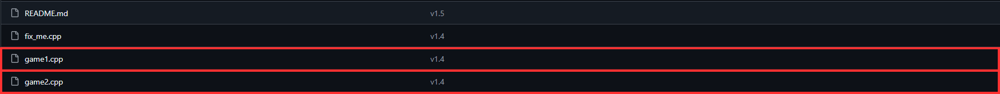
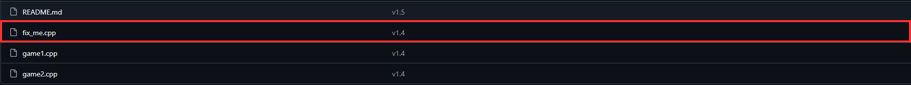
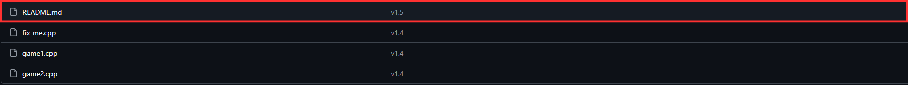

#  learn cpp by projects

⭐ If you like this project, consider leaving a star!

> ## **Language**
> - 🇬🇧 **[English](#english)**
> - 🇮🇹 **[Italiano](#italiano)**
>
> ## **Contents**
>
> - [Introduction](#introduction) | [Introduzione](#introduzione)
> - [How to use this repository](#how-to-use-this-repository) | [Come usare la repository](#come-usare-la-repository)
> - [Difficulty and skills](#difficulty-and-skills) | [Difficoltà e competenze](#difficoltà-e-competenze)
> - [Contacts](#contacts) | [Contatti](#contatti)
> ---

##  English

### **Introduction**

This repository contains a collection of C++ programs created to help students learn this language. Of course, this repository is only a study resource, so I strongly recommend trying the programs yourself to improve your programming skills.

I'm still working on this project, so the repository is currently just a demo of what I want to create. If you find some problems, that's completely normal. At the moment I'm working on other projects, so this repository will not receive many updates over the next two months.

Another important thing: all the programs have been written entirely by **Thealexio**, while the English translation has been made with the help of AI. If you find translation mistakes or grammatical errors, I apologize. As soon as I have more time to dedicate to this project, I will also review the grammar of every file.

Finally, the goal is to create a collection of projects with exercises and explanations. If you also have some simple C++ projects, I would really appreciate it if you contributed to this repository and helped expand the project.

---

### **How to use this repository**

I organized the projects by difficulty. Inside every folder you will find different files organized with the following structure:

> **Code files**

- they have the same name as the folder and contain a C++ program with comments explaining how it works.
- folders **1** and **2** are available only in English, while the following ones include both the Italian and English versions.
- some folders may contain more than one source file.

> **`fix_me.cpp` files**

- these files are available in every folder and are designed to help you practice by fixing bugs or completing parts of the code.
- every folder also contains the solutions inside its own `README`.

> **`README.md` files**

- every folder has its own `README`, available in both Italian and English.
- they contain links and detailed explanations to help you learn C++ and the libraries used.
- they are designed to be simple to read and as interactive as possible.
- at the bottom of each `README` you will find `details` sections containing the solutions for the various `fix_me.cpp` files.

---

### **Difficulty and skills**

Below you can find the required skills and the difficulty level for each folder.

Click to view the table

> ---
>
> [**1 For Start**](https://github.com/Thealexio-exe/learn-cpp-by-projects/tree/main/1%20For%20Start%20%20%23super-esye)
> Perfect for people who have never used C++. No previous knowledge required.
>
> [**2 Triangle Classifier**](https://github.com/Thealexio-exe/learn-cpp-by-projects/tree/main/2%20triangle%20classifier%20%20%23esye)
> Requires knowledge of `if` statements and conditions.
>
> [**3 Code Cleanup**](https://github.com/Thealexio-exe/learn-cpp-by-projects/tree/main/3%20Code%20Cleanup%20%20%23medium)
> Learn how to write clean, readable code with good formatting.
>
> [**4 Simple Figure Generator**](https://github.com/Thealexio-exe/learn-cpp-by-projects/tree/main/4%20simple%20figure%20generator%20%20%23medium)
> Requires knowledge of `for` loops.
>
> [**5 Rock, Paper, Scissors**](https://github.com/Thealexio-exe/learn-cpp-by-projects/tree/main/5%20Rock%2C%20Paper%2C%20Scissors%20%20%23hard)
> Requires functions and the `cstdlib`, `ctime` and `fstream` libraries.
>
> This list will be updated in the future.
>
> ---

---

### **Contacts**

If you find a bug or have a suggestion, feel free to open an Issue in the repository or contact me by email: `argenti.projects@gmail.com`

---

##  Italiano

### **Introduzione**

Questa repository contiene una raccolta di programmi in C++, con lo scopo di aiutare gli studenti a imparare questo linguaggio, ovviamete questa repository e solo un supporto per lo studio, quindi consiglio fortemete l'utilizzo dei vari programmi per migliorare le proprie capacità.

Sto ancora lavorando a questo progetto infatti la repository è ancora una demo di ciò che voglio creare, quindi se ci sono ancora alcuni problemi è normale sto al momento lavorando ad altri progetti per questo non fara molti update per i prossimi due mesi.

Un'altra cosa importante: i programmi sono stati scritti interamente da **Thealexio**, mentre la traduzione in inglese è stata fatta con l'aiuto dell'AI. Se ci sono problemi o errori nelle traduzioni mi scuso, appena avrò veramente tempo da dedicare a questo progetto inizierò anche a rivedere la grammatica di ogni file.

Infine l'obiettivo è creare una raccolta di progetti con esercizi e spiegazioni. Se avete anche voi dei progetti semplici in Cpp mi farebbe molto piacere se contribuiste a questo progetto cosi da espandere il progetto.

---

### **Come usare la repository**

Ho organizzato i vari programmi in ordine di difficoltà. In ogni cartella troverai diversi file strutturati con la seguente logica:

> **File con codice**

- hanno lo stesso nome della cartella e al loro interno troverai un programma in C++ con commenti che spiegano come funziona.
- nelle cartelle **1** e **2** i file sono scritti solo in inglese, mentre nelle successive troverai sia la versione italiana che quella inglese.
- in alcune cartelle potrebbero essere presenti più file.

> **File `fix_me.cpp`**

- sono file presenti in ogni cartella e servono per esercitarti a risolvere bug o completare parti di codice, così da verificare ciò che hai imparato.
- in ogni cartella troverai anche le soluzioni all'interno del relativo `README`.

> **File `README.md`**

- ogni cartella possiede il proprio `README`, sia in italiano che in inglese.
- contengono link e spiegazioni dettagliate per approfondire lo studio del C++ e delle librerie utilizzate.
- sono pensati per essere semplici da leggere e il più possibile interattivi.
- in fondo a ogni `README` troverai dei pulsanti (`details`) per visualizzare le soluzioni dei vari `fix_me.cpp`.

---

### **Difficoltà e competenze**

Qui sotto trovi una tabella con le competenze richieste e il livello di difficoltà di ogni cartella.

Clicca per vedere la tabella

> ---
>
> [**1 For Start**](https://github.com/Thealexio-exe/learn-cpp-by-projects/tree/main/1%20For%20Start%20%20%23super-esye)
> Perfetta per chi non ha mai usato il C++. Nessuna competenza richiesta.
>
> [**2 Triangle Classifier**](https://github.com/Thealexio-exe/learn-cpp-by-projects/tree/main/2%20triangle%20classifier%20%20%23esye)
> Richiede l'utilizzo degli `if` e delle condizioni.
>
> [**3 Code Cleanup**](https://github.com/Thealexio-exe/learn-cpp-by-projects/tree/main/3%20Code%20Cleanup%20%20%23medium)
> Serve a imparare a scrivere codice leggibile e con una buona sintassi.
>
> [**4 Simple Figure Generator**](https://github.com/Thealexio-exe/learn-cpp-by-projects/tree/main/4%20simple%20figure%20generator%20%20%23medium)
> Richiede l'utilizzo dei cicli `for`.
>
> [**5 Rock, Paper, Scissors**](https://github.com/Thealexio-exe/learn-cpp-by-projects/tree/main/5%20Rock%2C%20Paper%2C%20Scissors%20%20%23hard)
> Richiede l'utilizzo di funzioni e delle librerie `cstdlib`, `ctime` e `fstream`.
>
> In futuro questa lista verrà aggiornata.
>
> ---

---

### **Contatti**

Se trovi un bug o hai un suggerimento, puoi aprire una Issue nella repository oppure contattarmi privatamente via email: `argenti.projects@gmail.com`